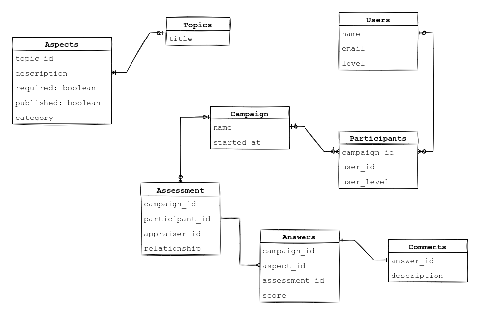

# Requirements

## Reviews Module

This module is responsible for dealing with peer performance evaluations based on cultural topics divided into aspects.

First phase requirements:

### Topics and Aspects

- Should save Topics. Topics should have a title.
  - Topics have many Aspects.
- Aspects must have a description, a field to indicate whether this aspect is available, another field to indicate when it is required, and a category.
  - The initial categories are: General Skills, Managment Skills, and Technicall Skills.

### Campaigns

- A Campaign is a kind of event that happens from time to time. It should have a name and a start date.
- A Campaign have many Assessments.
  - Each Assessment must have a Participant as the person under evaluation, an appraiser and the type of relationship between them.
- Assessment have many Answers.
  - Answers should have a score. A score can be null tho.
  - Answer can receive comments.

